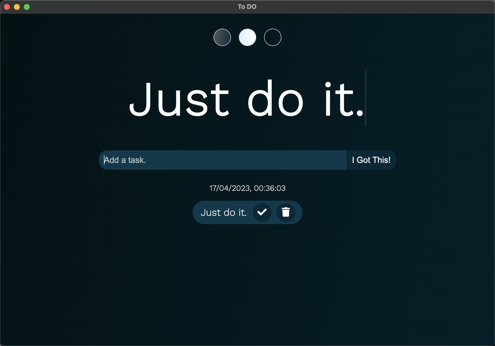
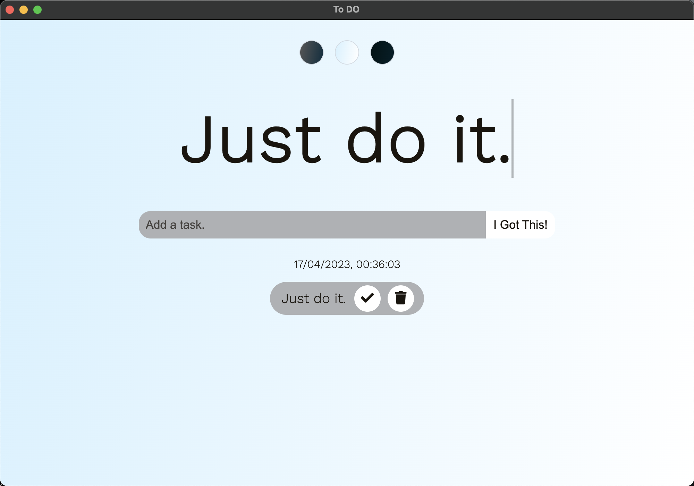
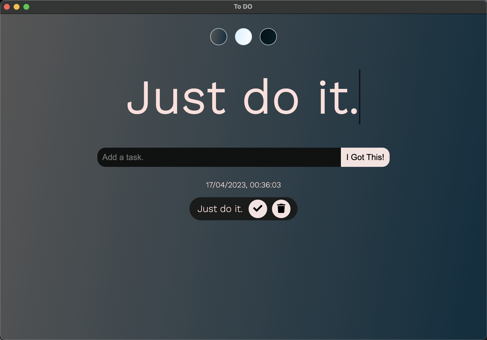

# Todo List Electron Application 🔥

### Showcase

### Features

* Application can be built for any Operating System
 
* Can be built for arm64, arm, win32, amd, etc
 
* Stores Your list in Local Storage so when app closes you dont have to worry about it
 
* Has cool animations
 
* Themes

### Requirments to build

* npm
 
* electron
 
* electron-packager

### How to install?
first

* `npm install`
Or
* `yarn add`

Then

* `npm run package`
Or
* `yarn package`

### Credits 

* [tusharnankani](https://github.com/tusharnankani/ToDoList) - code
* [Sharuu](https://github.com/sharifjameel90) - Building web to application